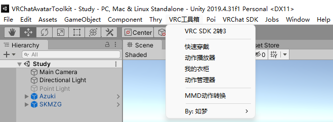
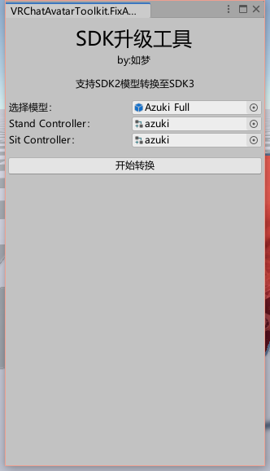
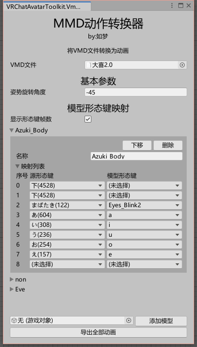
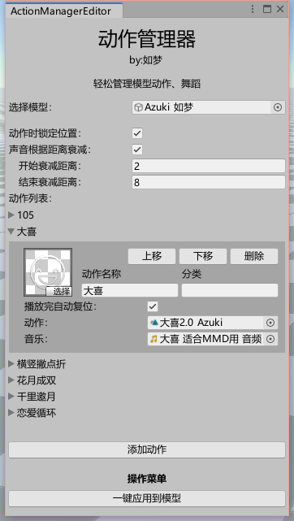

# VRChatAvatarToolkit V2

Unity VRChat SDK 辅助设计工具箱 V2

1. 本插件为VRChat的小伙伴们量身定做，致力于用最简单的方式，给玩家们带来更多的乐趣
2. 本插件完全开源，有需要的功能、使用中出现的问题都欢迎提出

**下载链接：**
[前往发布页](https://gitee.com/cmoyuer/vrchat-avatar-toolkit/releases/latest)

**视频教程：**
[B站](https://space.bilibili.com/2562878)

**更多插件/打赏作者：**
[爱发电](https://afdian.net/@moyuer?tab=feed)

## V2版本介绍
 - V2版本插件依赖于VRChat官方开发的[**Creator Companion**](https://vcc.docs.vrchat.com/)工具（简称CC）
 - 使用CC可方便管理各种第三方插件，并在不需要的时候可以干净地删除
 - 新版本移除了DynamicBone的依赖，可通过设置宏定义 USE_DynamicBone 来恢复该支持
 - 不使用CC的朋友，请使用v1.3.1版本的插件

## 使用方法

1. 使用CC工具创建Avatar工程；
2. Unity打开项目；
3. 双击导入本插件（unitypackage文件）；
4. 在顶端菜单栏会出现“VRC工具箱”;
5. 选择需要使用的工具即可；
6. 温馨提示：相应工具的使用教程请点击下面的蓝色标题进行查看。

## [VRC SDK 2转3（FixAvatarToSdk3）](Example/FixAvatarToSdk3/main.md)

1. 能将SDK2的Prefab预制件、FBX模型转换为SDK3模型，并自动生成SDK3全部的控制器；
2. 生成后的模型经过检查参数后，可以直接上传；

## [快速穿戴（QuickDressed）](Example/QuickDressed/main.md)

1. 能快速将模型与其相应的衣服绑定在一起，并保留原有的 VRCPhysBone 动骨参数；
2. 将动态骨骼组件移动到衣服根目录上，隐藏衣服同时关闭动骨，以优化性能；
3. 支持父约束模式，使人物骨骼保持整洁；

## [动作播放器（AvatarAnimationPlayer）](Example/AvatarAnimationPlayer/main.md)

1. 可搭配【快速穿戴】一起使用；
2. 在运行场景后可让模型做出相应动作，以查看模型的衣服、动骨参数是否合适；

## [我的衣柜（AvatarWardrobe）](Example/AvatarWardrobe/main.md)

1. 轻松管理多套衣服；
2. 通过拖拉方式，实现多套衣服管理（理论可支持255套衣服）；
3. 不影响模型原来的动画（手势、表情等）；
4. 一键导出换装所需的动画、菜单项、菜单参数、FX控制层；

## [MMD动作转换（Vmd2Anim）](Example/Vmd2Anim/main.md)

1. 将MMD所使用的VMD文件，一键转换为Unity使用的Anim文件；
2. 插件内置模型“Kinsama式初音ミクV4C”用于解析动作；
3. 用户可根据实际需要，添加解析动画使用的MMD模型；
4. 如输出的动画有异常，建议添加一个能播放VMD动作的模型；

## [动作管理器（ActionManager）](Example/ActionManager/main.md)

1. 只需拖拽，就能让你轻松管理多套动作舞蹈；
2. 拖过拖拉方式，添加多套音乐、动作组合，快速添加舞蹈、配乐；
3. 不影响模型原有的动画、菜单参数；
4. 可设置声音衰减参数；
5. 一键生成所需动画，并调整模型的各种参数，包括模型内的AudioSource组件，开关音乐组件的动画，Base、Action、FX这三个控制器，VRC菜单和参数；

## 更多功能敬请期待。。。
